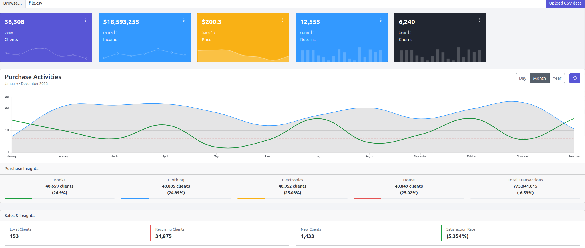

# Data science Dashboard

My response to a data engineering competition hosted by [Desa Analytics](https://www.linkedin.com/groups/14527011/)

### TODO List:

- [x] build from a dockerfile
- [x] run MySQL database + FastAPI server
- [ ] run data processing and exploration pipeline using demo data
- [ ] design/implement a high-level insights dashboard using NodeJs/HTML/CSS-based develop to visualize the data processing outcomes and insights
- [ ] submit zipped folder containing all competition materials

Please feel free to contact me or post your issues/comments.

<p align="center">

 </p>
<p align="center">
The developed E-commerce dashboard
</p>

# I. Configuration file

First of all, please create the configuration file named `.env>` in the project folder using the following template

```
PROJECT_NAME=dashboard
VERSION=v1

#### -----------    DATA-SCIENCE APP  -----------
IMG_BUILDER=dashboard-backend
PYTHON_VERSION=python:3.8
APP_CNTNR_NAME=datascience
APP_SERVER_PORT=8383
APP_HOST_PORT=8383

#### -----------   WEB-APP  -----------
WEBAPP_IMG_BUILDER=dashboard-frontend
WEBAPP_CNTNR_NAME=webserver
WEBAPP_SERVER_PORT=8000
WEBAPP_HOST_PORT=8000


#### -----------   MYSQL CREDENTIALS  -----------
MySQL_CNTNR_NAME=database
MYSQL_ROOT_PASSWORD=<rootpassword>
MYSQL_DATABASE=<table name>
MYSQL_USER=<username>
MYSQL_PASSWORD=<password>

```

# II. Docker setup instructions

The project can run on Docker using the two following setups:

1. Setup the Docker environment

```
$ ./bash/1-build.sh
```

2. Run the data Science pipeline & Dashboard containers

```
$ ./bash/3-run.sh
```

3. Get/Open the Web-server URL

```
$ ./bash/4-open-app-servers-in-browser.sh
```

4 . Stop the running docker containers

```
$ ./bash/5-stop-servers.sh
```

# III. Data sample

Download the competition csv file from [here](https://drive.google.com/drive/folders/1WywM-pVk9C-BrR4kDTcNfuqILQfMYUA5) and save it to the `./data` folder.

# Acknowledgement

The main resources used/adapted adapted with/without modifications are cited as follows:

- [Angular chart from API ](https://github.com/desoga10/angular-chart/tree/master) by [desoga10](https://github.com/desoga10)
- [Examples of Dashboard components](https://coreui.io/product/free-bootstrap-admin-template/)
